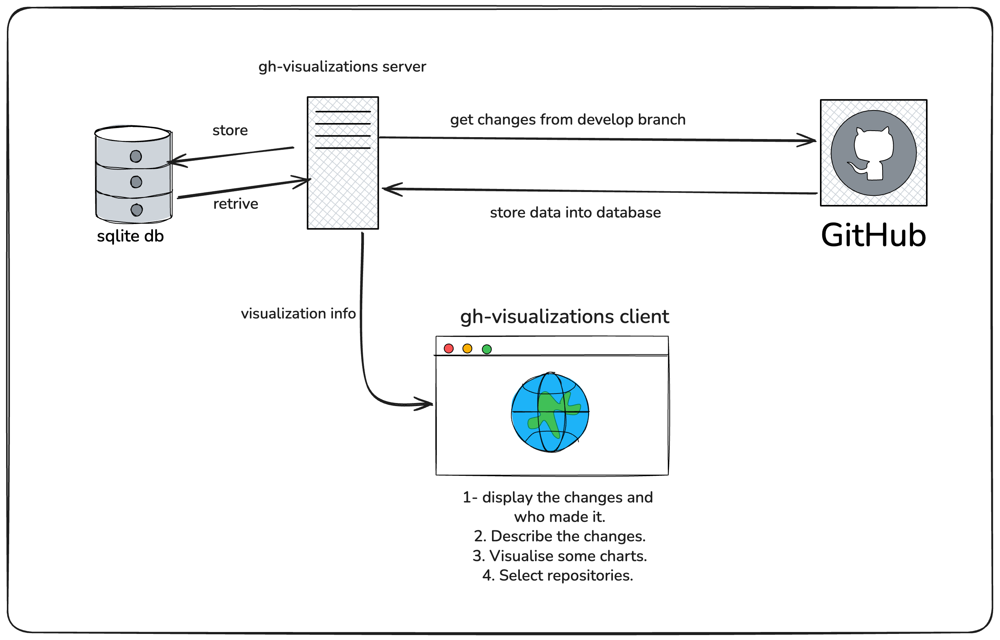

# gh-visualizations

This service design to help me up-to-date with some repos I select

## Initial Design



## Running the server

```bash
pnpm install
cp .env.example .env   # optional, every value has a default
pnpm start             # http://localhost:3000
```

Set `GITHUB_TOKEN` in `.env` before adding more than a repository or two —
unauthenticated GitHub calls are capped at 60 requests/hour.

Migrations under `migrations/` apply automatically on start. A background job
(`SYNC_CRON`, every 5 minutes by default) re-syncs every tracked repository;
set `SYNC_ENABLED=false` to run the API on its own.

## Running the client

The React client is a standalone package under `client/` — this repository is
not a pnpm workspace, so it installs on its own:

```bash
cd client
pnpm install
pnpm dev            # http://localhost:5173
```

`pnpm dev` proxies `/api` to `http://localhost:3000`, so run the server too. To
point the client at a different host instead, set `VITE_API_URL` (and allow that
browser origin via the server's `CORS_ORIGIN`).

| Command      | What it does                          |
| ------------ | ------------------------------------- |
| `pnpm dev`   | Vite dev server with the API proxy.   |
| `pnpm build` | Typecheck and build to `client/dist`. |
| `pnpm test`  | Vitest + Testing Library suite.       |

The dashboard covers the four things the design asks the client for: pick which
repositories to track, see what changed and who made it, read the description
that came with each change, and read the activity charts. It follows the
system colour scheme, with a toggle to pin light or dark.

## API

All responses are `{ "status": "success", "data": { … } }`; errors are
`{ "errors": [{ "message": …, "field"?: … }] }`.

| Method   | Path                                     | Description                                                                                             |
| -------- | ---------------------------------------- | ------------------------------------------------------------------------------------------------------- |
| `GET`    | `/healthz`                               | Liveness probe.                                                                                         |
| `GET`    | `/api/v1/repositories`                   | Tracked repositories.                                                                                   |
| `POST`   | `/api/v1/repositories`                   | Track a repository. Body: `{owner, name}` or `{url}`. Verifies it against GitHub and runs a first sync. |
| `GET`    | `/api/v1/repositories/:id`               | One repository.                                                                                         |
| `DELETE` | `/api/v1/repositories/:id`               | Stop tracking; cascades to its commits and pull requests.                                               |
| `POST`   | `/api/v1/repositories/:id/sync`          | Sync now, outside the cron schedule.                                                                    |
| `GET`    | `/api/v1/repositories/:id/commits`       | Commits, newest first. `?limit=&offset=`                                                                |
| `GET`    | `/api/v1/repositories/:id/pull-requests` | Pull requests, newest first. `?limit=&offset=`                                                          |
| `GET`    | `/api/v1/repositories/:id/stats`         | Chart data: totals, a dense daily series, per-author breakdowns. `?days=` (default 30)                  |
| `GET`    | `/api/v1/commits`                        | Recent commits across every repository.                                                                 |
| `GET`    | `/api/v1/pull-requests`                  | Recent pull requests across every repository.                                                           |
| `GET`    | `/api/v1/github/users/:username/repos`   | What a GitHub user has available to track (repository picker).                                          |

### Which branch gets synced

`SYNC_BRANCH` (default `develop`), falling back to the repository's own default
branch when it has no such branch. The branch actually read is stored on each
repository as `syncedBranch` and on each commit as `branch`.
